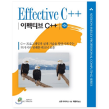
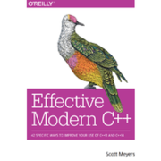
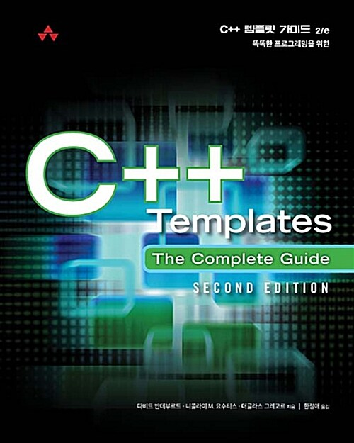
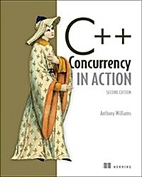

<!--  -->

### I mainly use these.

  

### I'm used to these

### :pencil2: I have experienced ( or I'm learning )

<!---->

## Algorithm Score

## ✨ Finished !!
|   | title | progress  | remark  |
| ---  |  --- | --- | --- |
|  | **Effective C++ (Scott Meyers)** | 1 cycle | https://ysbaekfox.github.io/categories/effectcpp |
  
## 🌱 Reading !!
|   | title | progress  | remark  |
| ---  |  --- | --- | --- |
|  | **Effective Modern C++ (Scott Meyers)** | ~ Chapter 5 | https://github.com/ysbaekFox/EffectiveModernCpp_ysbaekFox |
|  | **C++ Templates - The Complete Guide** | | |
|  | **C++ Concurrency in Action** | ~ Chapter 5 | https://github.com/ysbaekFox/concurrency-in-action |

<!--
**ysbaekFox/ysbaekFox** is a ✨ _special_ ✨ repository because its `README.md` (this file) appears on your GitHub profile.

Here are some ideas to get you started:

- 🔭 I’m currently working on ...
- 🌱 I’m currently learning ...
- 👯 I’m looking to collaborate on ...
- 🤔 I’m looking for help with ...
- 💬 Ask me about ...
- 📫 How to reach me: ...
- 😄 Pronouns: ...
- ⚡ Fun fact: ...
-->
